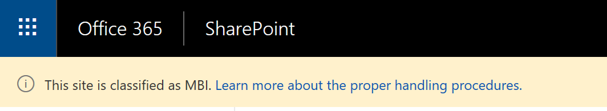
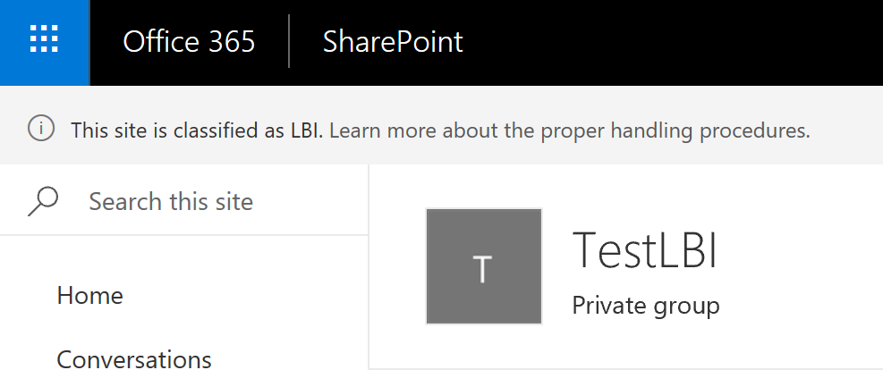
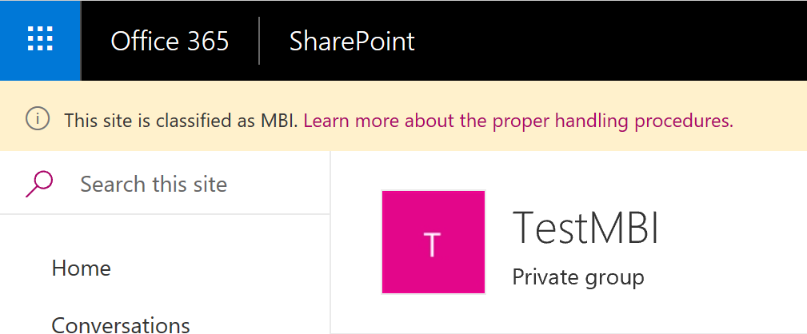
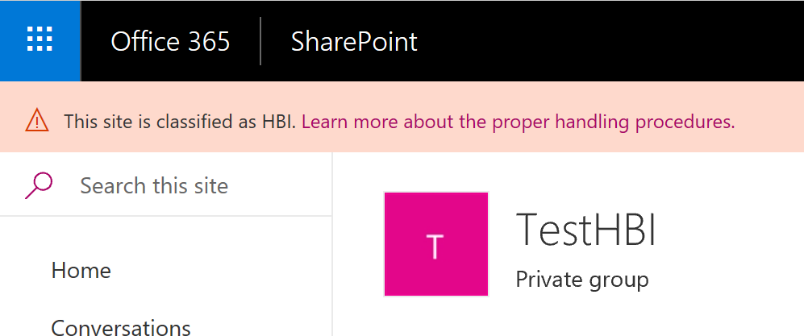

# Information Security Classification Application Customizer

## Summary

A SharePoint Framework application customizer showing how to display a site's information security classification on every page, reading for the site's property bags.



## Used SharePoint Framework Version


## Applies to

* [SharePoint Framework Extensions Developer](https://dev.office.com/sharepoint/docs/spfx/extensions/overview-extensions)
* [Office 365 developer tenant](http://dev.office.com/sharepoint/docs/spfx/set-up-your-developer-tenant)

## Solution

Solution|Author(s)
--------|---------
react-application-classification|Hugo Bernier ([TahoeNinjas.blog](https://tahoeninjas.blog), [@bernierh](https://twitter.com/bernierh))

## Version history

Version|Date|Comments
-------|----|--------
1.0.0|April 23, 2018|Initial release

## Disclaimer

**THIS CODE IS PROVIDED *AS IS* WITHOUT WARRANTY OF ANY KIND, EITHER EXPRESS OR IMPLIED, INCLUDING ANY IMPLIED WARRANTIES OF FITNESS FOR A PARTICULAR PURPOSE, MERCHANTABILITY, OR NON-INFRINGEMENT.**

---

## Prerequisites

* Office 365 Developer tenant with a modern site collection

## Minimal Path to Awesome
* Using SharePoint Designer or the Chrome SharePoint Editor Extension, edit one or more sites to add a value called *sc_BusinessImpact* to their property bags. The value should contain one of LBI, MBI, or HBI.
* Create a page that will be used to display proper information security handling procedures. Note the page's url. For this example, we'll use /SitePages/Handling-Instructions.aspx as our page. 
* clone this repo
* in the command line run
  * `npm i`
  * `gulp serve --nobrowser`
* open a modern site where you defined the *sc_BusinessImpact* property bag.
* append the following query string parameters to the home page URL

```text
?loadSPFX=true&debugManifestsFile=https://localhost:4321/temp/manifests.js&customActions={"4017f67b-80c7-4631-b0e5-57bd266bc5c1":{"location":"ClientSideExtension.ApplicationCustomizer","properties":{"ClassificationPropertyBag":"sc_x005f_BusinessImpact","DefaultClassification":"","DefaultHandlingUrl":"/SitePages/Handling-instructions.aspx"}}}
```

If you go to a site where *sc_BusinessImpact* is *LBI* you'll see the following:


If you go to a site where *sc_BusinessImpact* is *MBI* you'll see the following:


If you go to a site where *sc_BusinessImpact* is *HBI* you'll see the following:


Otherwise, the site will display whatever value you set in the *DefaultClassification* parameter, above. If you leave it blank (as this example shows), the application customizer will not display a header.

## Deployment

In order to deploy the sample solution in a real environment, you need to execute the following steps:
* bundle and package the solution by executing the following commands in the command line:
  * `gulp bundle --ship`
  * `gulp package-solution --ship`
* upload the content of the ./temp/deploy subfolder of the sample root folder into the target hosting environment
* add to the "Apps for SharePoint" library of the AppCatalog in your tenant the classification-extension.sppkg file that you will find under the ./sharepoint/solution subfolder of the sample root folder
* the sample is tenant-wide available, so you don't need to install it to every single target site, you simply need to bind the application customizer to the target site. In order to do that, you can use the PowerShell script [ActivateClassificationExtension.ps1](./ActivateClassificationExtension.ps1). Note that you'll also need to update [sites.csv](./sites.csv) to include the list of URLs where you wish to deploy.

## Features

This project contains sample SharePoint Framework application customizer extension built using React and Office UI Fabric React. The application customizer reads from a site's property bags to determine the site's information security classification and renders a top header showing the security classification label, with a link to proper handling procedures.

This sample illustrates the following concepts on top of the SharePoint Framework:

* using Office UI Fabric React to build SharePoint Framework application customizers that seamlessly integrate with SharePoint
* using React to build SharePoint Framework application customizers
* reading from a site's property bags storage
